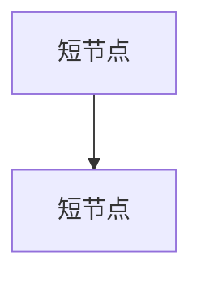

---
name: repo-global-map
description: 仓库认知加速系统。在拿到新代码仓库后，用最短时间建立全局地图，并可扩展产出架构、链路、风险、依赖、变更策略、运维与上手文档。
---

# Repo Global Map Skill (Pro)

## 目标

把“读代码”升级成“建立认知资产”：

1. 在最短时间建立可行动的系统全局地图。
2. 产出可复用文档，而不是一次性口头总结。
3. 对不确定信息显式管理，避免错误自信。

## 适用场景

当用户提到以下意图时启用：

- “快速看懂新仓库”
- “建立系统全局地图/架构图”
- “接手项目，需要风险和关键链路”
- “做 onboarding、交接、改造前摸底”

## 三档分析模式

默认根据用户时间预算选择模式；若未给预算，使用 `Standard`。

1. `Lite`（10-20 分钟）
   - 目标：低认知负担快速上手。
   - 产物：事实清单 + 3 张核心图 + 3 个下一步动作。
2. `Standard`（30-60 分钟）
   - 目标：支持需求开发与问题排查。
   - 产物：Lite 全部 + 模块目录 + 风险登记 + 依赖地图 + 变更入口建议。
3. `Deep`（半天到 2 天）
   - 目标：支持重构、迁移、性能/稳定性治理。
   - 产物：Standard 全部 + 时序图 + 运维与发布路径 + 可观测性缺口 + 技术债分级路线图。

## 固定产物矩阵

所有模式至少生成 `artifacts` 中对应模板内容。缺失信息用 `UNKNOWN_*` 并附最小验证动作。

1. `00-intake.md` 任务与范围定义
2. `01-fact-sheet.md` 关键事实页
3. `02-system-diagrams.md` 多视角图集
4. `03-module-catalog.md` 模块与职责清单（Standard+）
5. `04-dependency-risk-register.md` 依赖与风险登记（Standard+）
6. `05-change-entry-guide.md` 变更入口与调试路径（Standard+）
7. `06-ops-release-observability.md` 运维、发布、可观测性（Deep）
8. `07-roadmap-techdebt.md` 演进路线与技术债优先级（Deep）
9. `08-timebox-playbook.md` 时间盒执行手册（建议所有模式）
10. `09-quality-scorecard.md` 质量评分与迭代记录（建议所有模式）
11. `10-command-cookbook.md` 快速侦察命令集（建议所有模式）
12. `11-output-index-template.md` 输出索引与执行摘要（建议所有模式）
13. `12-reasoning-iteration.md` 推理摘要迭代记录（建议所有模式，最终输出前必做）

## 输出语言规范

默认用中文生成报告文档、图表标题、表格字段、执行摘要、风险说明和下一步动作，因为目标读者通常是中文母语者。

允许保留英文的情况：

- 代码符号、文件路径、命令、配置项、协议名、框架/库名等原始技术实体。
- `HIGH` / `MEDIUM` / `LOW`、`P0` / `P1` / `P2`、`UNKNOWN_*`、`Done` / `WIP` / `NA` 等状态值或占位值。
- 原仓库中已有的英文业务术语；首次出现时尽量补一句中文解释。

如果用户明确要求英文或双语，以用户要求为准；否则交付物应优先中文可读。

## 证据纪律（必须执行）

每条关键结论必须附：

- `evidence`: 文件路径 + 关键段落/符号（函数、类、配置项）
- `confidence`: `HIGH` / `MEDIUM` / `LOW`
- `impact`: 若判断错误会影响什么决策

禁忌：

- 把推测写成事实
- 只给结论不留证据
- 过度绘图但无法支持改动决策

## 执行工作流

### Step 0: 对齐任务边界（1-2 分钟）

填写 `00-intake.md`：

- 本次目标（上手/排障/改造/评审）
- 时间预算
- 最关心的业务路径
- 输出深度（Lite/Standard/Deep）

### Step 1: 仓库侦察（2-5 分钟）

优先命令：

```powershell
rg --files
Get-ChildItem -Force
rg -n "main\(|createApp|FastAPI|SpringApplication|router|Blueprint|express\(|gin.Default\(" -S .
```

macOS / Linux 等价命令：

```bash
rg --files
find . -maxdepth 2 -print
rg -n "main\(|createApp|FastAPI|SpringApplication|router|Blueprint|express\(|gin.Default\(" -S .
```

快速锁定：

- 入口与启动：`main*`, `app*`, `server*`, `cmd/`
- 配置系统：`.env*`, `config/*`, `application*.yml`, `settings*`
- 业务核心：`src/`, `services/`, `domain/`, `internal/`
- 数据边界：`repository/`, `dao/`, `migrations/`, `sql/`
- 运维发布：`.github/workflows/`, `Dockerfile*`, `helm/`, `k8s/`

### Step 2: 关键事实抽取（5-15 分钟）

按优先级读取：

1. README / docs / ADR
2. 启动入口与路由注册
3. 一条真实业务链路（HTTP、MQ、定时任务三选一）
4. 数据读写路径与外部依赖

将信息写入 `01-fact-sheet.md`。

### Step 3: 全局建模（5-20 分钟）

最少完成三图：

1. 系统上下文图（调用方、系统边界、外部依赖）
2. 容器/模块图（主要服务与基础设施）
3. 核心链路时序图（请求到落库/出站）

Deep 模式追加：

- 发布与运行拓扑图
- 风险热点关系图

### Step 4: 风险与变更策略（5-20 分钟）

输出：

- `03-module-catalog.md`：模块职责、所有权、耦合点
- `04-dependency-risk-register.md`：风险分级、触发条件、监控信号
- `05-change-entry-guide.md`：改动入口、最小验证、回滚点

### Step 5: 自检与迭代（3-10 分钟）

用评分卡评估，不足则回补证据：

- 全局清晰度（0-5）
- 链路可执行性（0-5）
- 风险可操作性（0-5）
- 证据完整性（0-5）
- 上手友好度（0-5）

总分 < 18 必须执行一次补充迭代。

图表化门槛（默认要求）：

- 最终交付中，图表/结构化内容（Mermaid + 表格）占比应 >= 70%。
- 若低于 70%，优先把段落说明改写为表格、流程图、时序图或矩阵。
- 结构化不等于“大图”。如果图会变宽、线会交叉或需要横向滚动，优先拆成多张小图或改为表格。

### Step 6: 推理摘要迭代（最终输出前必做，3-8 分钟）

使用 `12-reasoning-iteration.md` 执行一轮“显式推理质量提升”：

1. 列出关键假设（3-7 条）。
2. 为每条假设补齐证据、置信度、反例触发条件。
3. 写出“什么信息会推翻当前结论”。
4. 根据反例与证据缺口修正结论与优先级。
5. 最终输出只展示“推理摘要与修正结果”，不展示冗长内部思考过程。

该步骤目标是提升准确性与可审计性，不是增加冗余文字。

## 图表规范

1. 优先 Mermaid，节点名使用真实模块名。
2. 默认面向 Obsidian 阅读：单图要能在 13-15 寸屏幕和常见 Obsidian 窄栏中不横向滚动。
3. 单图建议 5-9 节点，最多 12 节点；边数不超过节点数 + 3。
4. 节点名控制在 2-5 个词或 18 个汉字以内；长路径、类名、证据放到图下表格，不塞进节点。
5. 优先使用 `flowchart TD` 纵向图；只有系统边界从左到右更清楚时才用 `LR`。
6. 禁止“中心节点放射所有依赖”的蜘蛛图。依赖超过 5 个时，拆成：
   - 上游/入口图
   - 核心模块图
   - 数据与外部依赖图
7. 关系类型超过 2 种时，不用一张 `graph` 混画；改用表格或多张图。
8. 对未知节点使用 `UNKNOWN_xxx`。
9. 在图下追加“图说明：用途 + 证据来源 + 为什么没有继续展开”。

### Obsidian 图表可读性预算

每张 Mermaid 图生成后必须快速自检：

| 检查项 | 通过标准 | 不通过时处理 |
|---|---|---|
| 宽度 | Obsidian 中无需横向滚动 | `LR` 改 `TD`，或拆图 |
| 节点数 | 5-9 最佳，最多 12 | 拆成局部图 |
| 边复杂度 | 边数 <= 节点数 + 3 | 删次要边，移到表格 |
| 交叉线 | 肉眼看不拥挤 | 改为分阶段图或 sequenceDiagram |
| 标签长度 | 节点短名，证据不进图 | 图下补证据表 |
| 决策价值 | 能帮助定位入口、边界、风险或改动点 | 删除该图或改为清单 |

推荐把“大而全”的图改成“小图 + 表格”：

````markdown
### 图名



| 节点 | 真实文件/符号 | 证据 | 置信度 |
|---|---|---|---|
| A | `path/to/file` | `function/class/config` | HIGH |
````

## 推荐目录输出

建议把本次分析结果输出到：

- `artifacts/repo-map/<YYYYMMDD-HHMM>/`

优先使用模板：

- `templates/00-intake.md`
- `templates/01-fact-sheet.md`
- `templates/02-system-diagrams.md`
- `templates/03-module-catalog.md`
- `templates/04-dependency-risk-register.md`
- `templates/05-change-entry-guide.md`
- `templates/06-ops-release-observability.md`
- `templates/07-roadmap-techdebt.md`
- `templates/08-timebox-playbook.md`
- `templates/09-quality-scorecard.md`
- `templates/10-command-cookbook.md`
- `templates/11-output-index-template.md`
- `templates/12-reasoning-iteration.md`

兼容旧版模板（可选）：

- `templates/quick-checklist.md`
- `templates/global-map-template.md`

可选脚本：

- `scripts/init-repo-map.ps1` 初始化分析工作区

## 快速成功标准

如果只能做最小集，确保做到：

1. 能用 3 句话讲清系统目标、入口和关键依赖。
2. 能指出 1 条可复现端到端链路。
3. 能给出 3 个高价值下一步动作（验证、降险、提效）。
