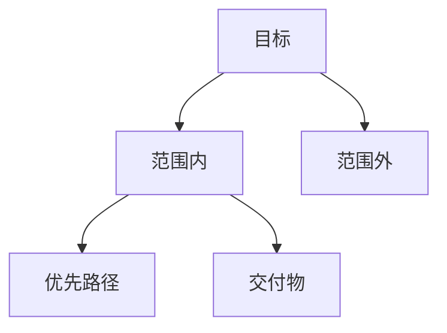

# 00 任务边界

## 任务卡

| 字段 | 值 |
|---|---|
| 分析目标 | |
| 时间预算 | |
| 模式（`Lite` / `Standard` / `Deep`） | |
| 优先业务路径 | |
| 预期交付物 | |

## 约束矩阵

| 约束类型 | 细节 | 影响 |
|---|---|---|
| 环境 | | |
| 权限/工具 | | |
| 领域知识缺口 | | |

## 完成标准

| 检查项 | 状态（`Y/N`） | 证据 |
|---|---|---|
| 一句话系统目标 | | |
| 一条可复现端到端链路 | | |
| 可行动风险清单 | | |
| 前 3 个下一步动作 | | |

## 范围快照

