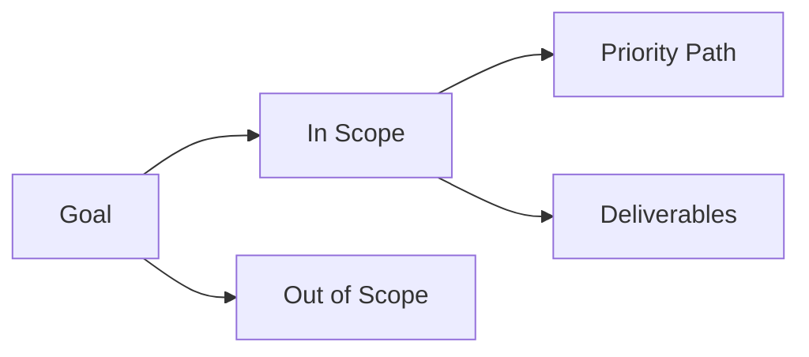

# 00 Intake

## Mission Card

| Field | Value |
|---|---|
| Analysis goal | |
| Time budget | |
| Mode (`Lite` / `Standard` / `Deep`) | |
| Priority business path | |
| Expected deliverables | |

## Constraints Matrix

| Constraint Type | Detail | Impact |
|---|---|---|
| Environment | | |
| Permission/Tool | | |
| Domain knowledge gap | | |

## Done Criteria Board

| Check | Status (`Y/N`) | Evidence |
|---|---|---|
| One-sentence system purpose | | |
| One reproducible E2E path | | |
| Actionable risk list | | |
| Top-3 next actions | | |

## Scope Snapshot

