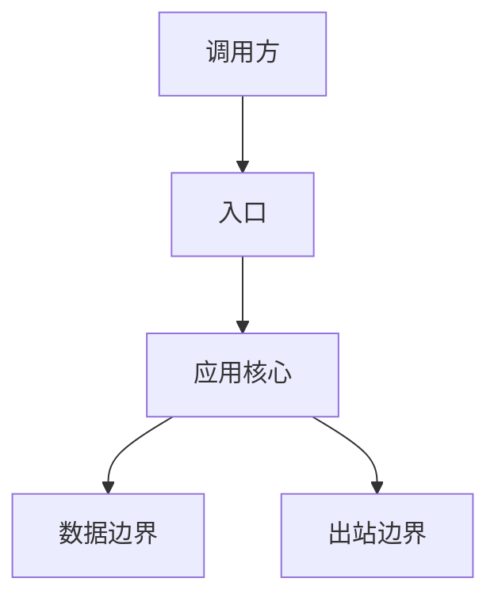
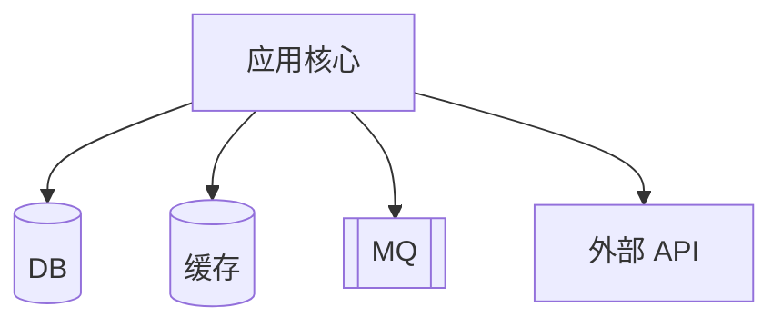
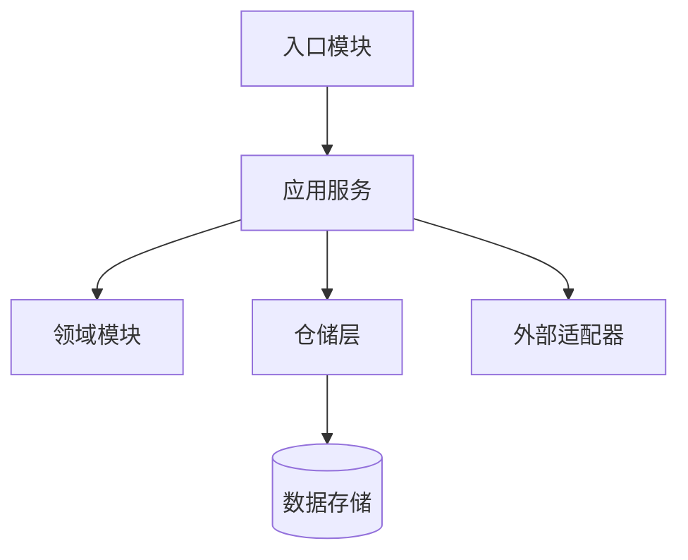
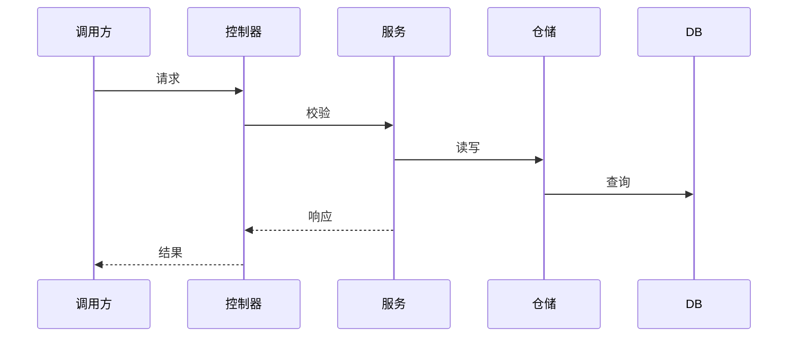
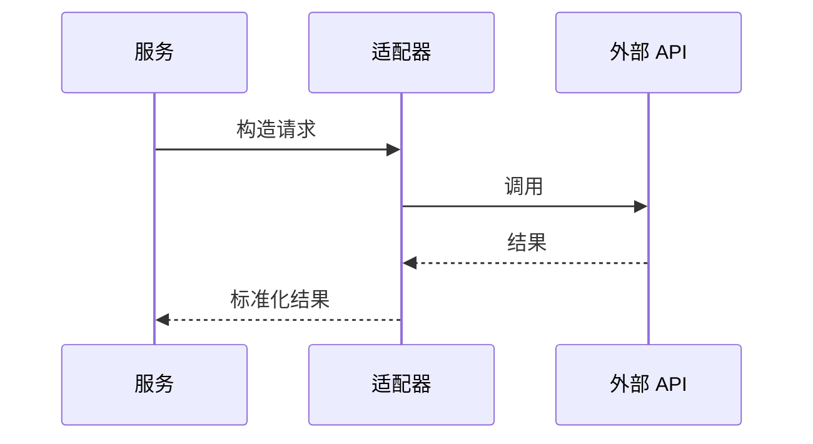
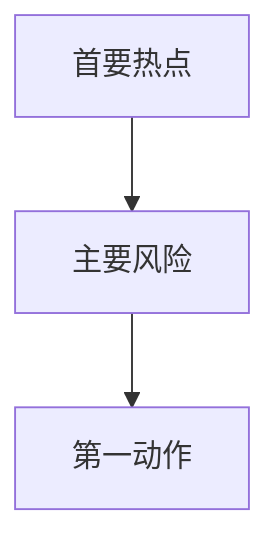

# 02 系统图集

## 图表可读性预算

| 规则 | 目标 | 结果 |
|---|---|---|
| Obsidian 宽度 | 窄栏阅读无需横向滚动 | |
| 单图节点数 | 5-9 最佳，最多 12 | |
| 单图边数 | `边数 <= 节点数 + 3` | |
| 标签长度 | 节点用短名，文件路径放到证据表 | |
| 拆图触发 | 依赖超过 5 个时拆为上游/核心/下游 | |

## A. 系统上下文图

证据：

| 节点 | 真实文件/符号 | 证据 | 置信度 |
|---|---|---|---|
| 调用方 | UNKNOWN | UNKNOWN | LOW |
| 入口 | UNKNOWN | UNKNOWN | LOW |
| 应用核心 | UNKNOWN | UNKNOWN | LOW |
| 数据边界 | DB/cache/MQ 汇总，必要时在下方展开 | UNKNOWN | LOW |
| 出站边界 | 外部服务汇总，必要时在下方展开 | UNKNOWN | LOW |

为什么没有继续展开：

## B. 数据与外部边界图

当上下文图会超过 5 个依赖时使用此图。

证据：

| 节点 | 真实依赖/配置 | 证据 | 置信度 |
|---|---|---|---|
| DB | UNKNOWN | UNKNOWN | LOW |
| 缓存 | UNKNOWN | UNKNOWN | LOW |
| MQ | UNKNOWN | UNKNOWN | LOW |
| 外部 API | UNKNOWN | UNKNOWN | LOW |

## C. 容器/模块图

证据：

| 节点 | 真实文件/符号 | 证据 | 置信度 |
|---|---|---|---|
| 入口模块 | UNKNOWN | UNKNOWN | LOW |
| 应用服务 | UNKNOWN | UNKNOWN | LOW |
| 领域模块 | UNKNOWN | UNKNOWN | LOW |
| 仓储层 | UNKNOWN | UNKNOWN | LOW |
| 数据存储 | UNKNOWN | UNKNOWN | LOW |
| 外部适配器 | UNKNOWN | UNKNOWN | LOW |

为什么没有继续展开：

## D. 核心时序图

证据：

可选出站调用（如存在）：

证据：

## E. 风险热点矩阵

优先使用矩阵，避免密集风险图。只有当关系结构本身重要时，才为前 1-2 个风险补小图。

| 热点 | 风险 | 触发条件 | 信号 | 第一动作 | 证据 |
|---|---|---|---|---|---|
| UNKNOWN | 测试缺口 | UNKNOWN | UNKNOWN | UNKNOWN | UNKNOWN |
| UNKNOWN | 强耦合 | UNKNOWN | UNKNOWN | UNKNOWN | UNKNOWN |
| UNKNOWN | 单一负责人 | UNKNOWN | UNKNOWN | UNKNOWN | UNKNOWN |

可选小风险图：

