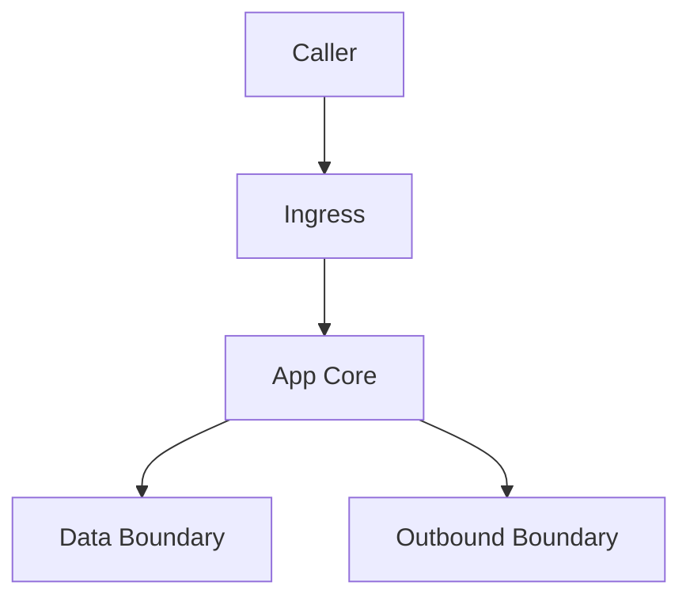
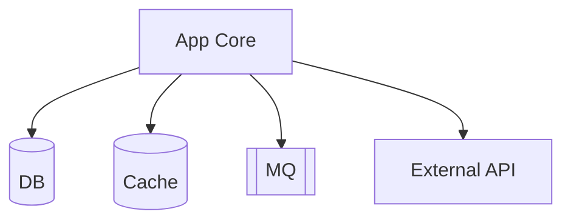
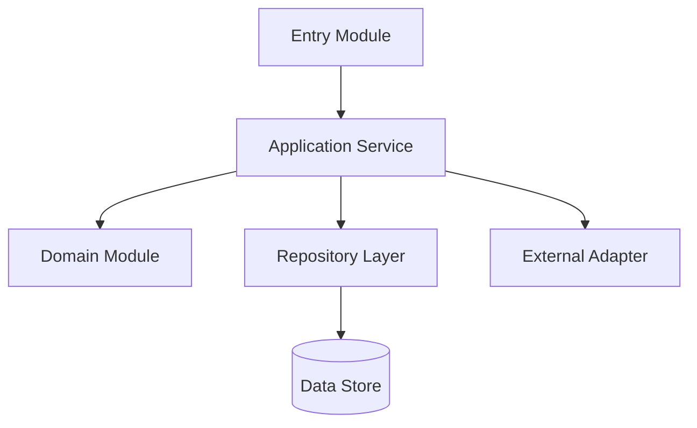
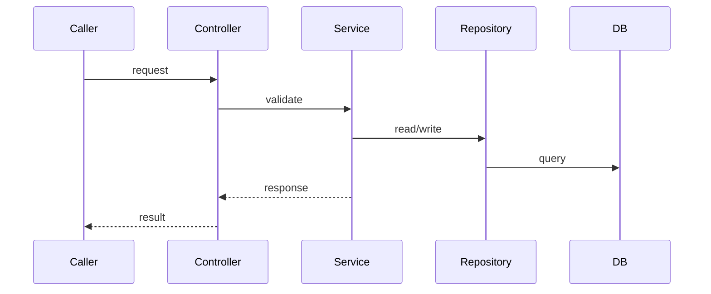
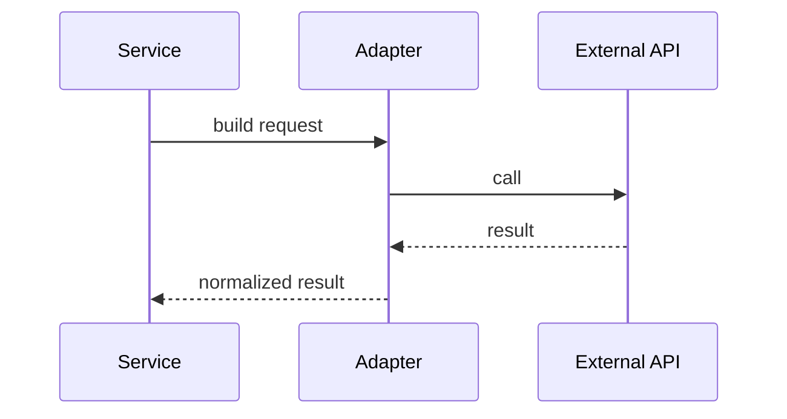
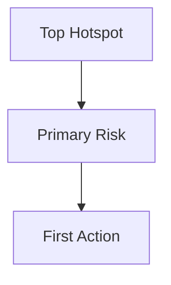

# 02 System Diagrams

## Diagram Readability Budget

| Rule | Target | Result |
|---|---|---|
| Obsidian width | No horizontal scrolling in a narrow note pane | |
| Nodes per diagram | 5-9 preferred, 12 max | |
| Edges per diagram | `edges <= nodes + 3` | |
| Label length | Short node names; file paths stay in evidence tables | |
| Split trigger | If dependencies exceed 5, split into upstream/core/downstream | |

## A. Context Diagram

Evidence:

| Node | Real file/symbol | Evidence | Confidence |
|---|---|---|---|
| Caller | UNKNOWN | UNKNOWN | LOW |
| Ingress | UNKNOWN | UNKNOWN | LOW |
| App Core | UNKNOWN | UNKNOWN | LOW |
| Data Boundary | DB/cache/MQ summary, expand below if needed | UNKNOWN | LOW |
| Outbound Boundary | External services summary, expand below if needed | UNKNOWN | LOW |

Why not expanded further:

## B. Data and External Boundary Diagram

Use this only when the context diagram would otherwise have more than 5 dependencies.

Evidence:

| Node | Real dependency/config | Evidence | Confidence |
|---|---|---|---|
| DB | UNKNOWN | UNKNOWN | LOW |
| Cache | UNKNOWN | UNKNOWN | LOW |
| MQ | UNKNOWN | UNKNOWN | LOW |
| External API | UNKNOWN | UNKNOWN | LOW |

## C. Container/Module Diagram

Evidence:

| Node | Real file/symbol | Evidence | Confidence |
|---|---|---|---|
| Entry Module | UNKNOWN | UNKNOWN | LOW |
| Application Service | UNKNOWN | UNKNOWN | LOW |
| Domain Module | UNKNOWN | UNKNOWN | LOW |
| Repository Layer | UNKNOWN | UNKNOWN | LOW |
| Data Store | UNKNOWN | UNKNOWN | LOW |
| External Adapter | UNKNOWN | UNKNOWN | LOW |

Why not expanded further:

## D. Core Sequence Diagram

Evidence:

Optional outbound call, if present:

Evidence:

## E. Risk Hotspots Matrix

Prefer this matrix over a dense risk graph. Add a small graph only for the top 1-2 risks when the relationship itself matters.

| Hotspot | Risk | Trigger | Signal | First action | Evidence |
|---|---|---|---|---|---|
| UNKNOWN | Test gap | UNKNOWN | UNKNOWN | UNKNOWN | UNKNOWN |
| UNKNOWN | Tight coupling | UNKNOWN | UNKNOWN | UNKNOWN | UNKNOWN |
| UNKNOWN | Single owner | UNKNOWN | UNKNOWN | UNKNOWN | UNKNOWN |

Optional small risk graph:

