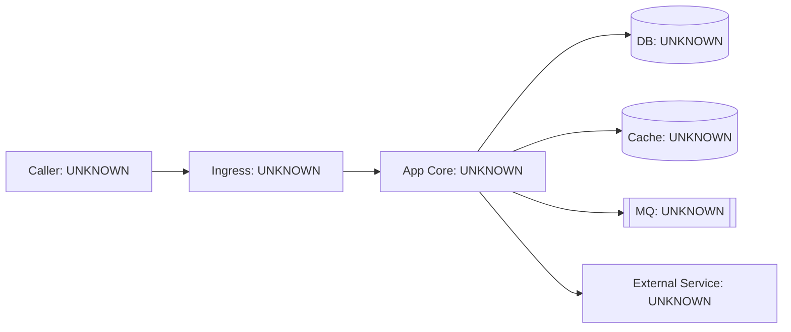
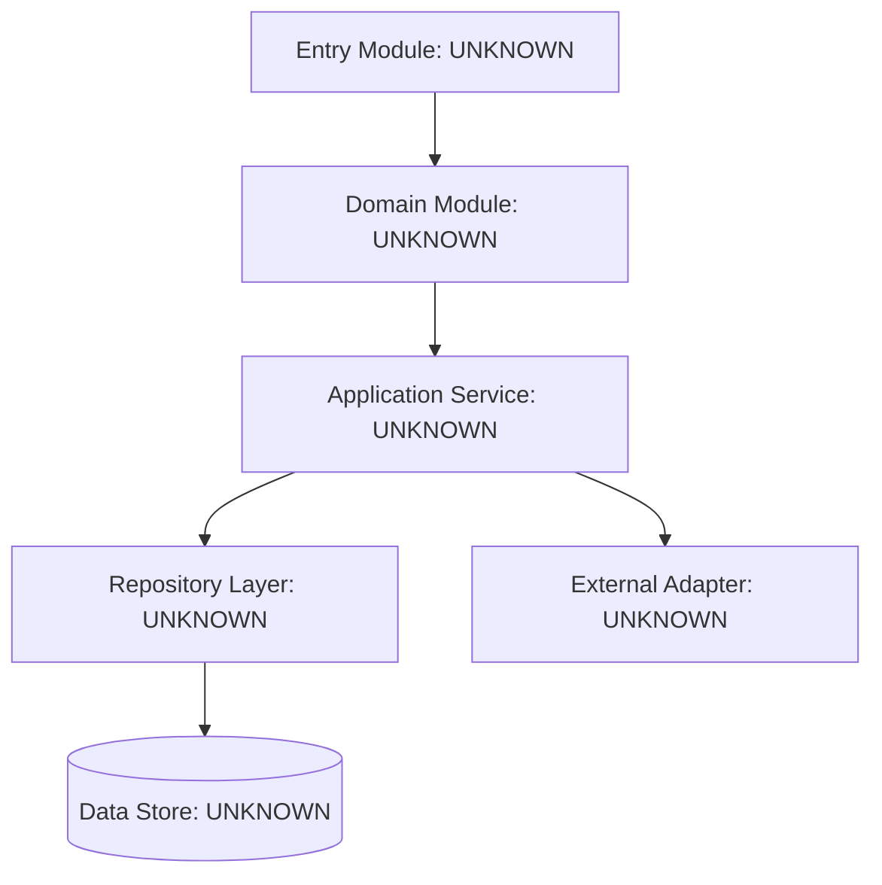
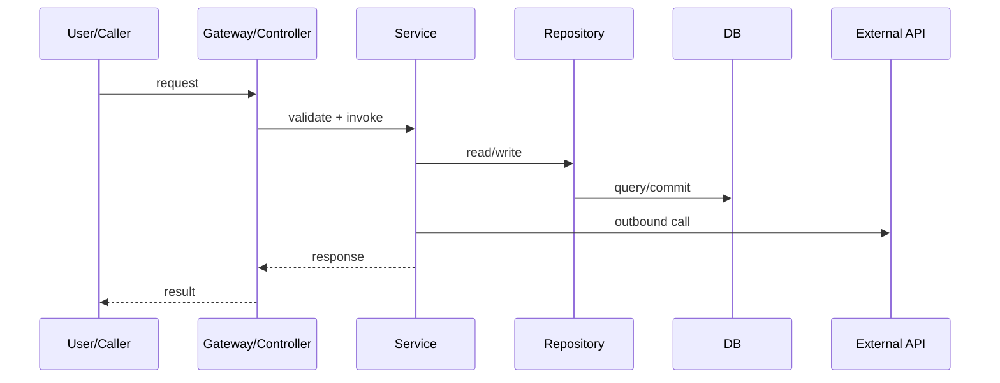
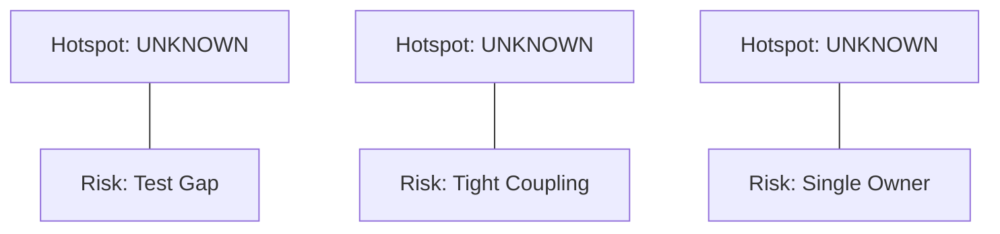

# 02 System Diagrams

## A. Context Diagram

Evidence:

## B. Container/Module Diagram

Evidence:

## C. Core Sequence Diagram

Evidence:

## D. Risk Hotspots Graph (Optional for Lite, required for Standard+)

Evidence:
