# 08 时间盒执行手册

## 模式时间线

```mermaid
gantt
    title 仓库地图时间盒
    dateFormat  HH:mm
    axisFormat  %H:%M
    section Lite 15m
    边界确认与扫描       :a1, 00:00, 04m
    事实页与三张图       :a2, after a1, 09m
    下一步动作           :a3, after a2, 02m
    section Standard 45m
    范围与证据           :b1, 00:00, 15m
    建模与风险           :b2, after b1, 20m
    评分与迭代           :b3, after b2, 10m
```

## 任务矩阵

| 模式 | 阶段 | 输出文件 | 时间 |
|---|---|---|---|
| Lite | 边界 | `00-intake.md` | 1-2m |
| Lite | 事实 | `01-fact-sheet.md` | 3-5m |
| Lite | 图表 | `02-system-diagrams.md` | 5-7m |
| Standard | 目录 | `03-05` | 10-15m |
| Deep | 运维 + 路线图 | `06-07` | 2h+ |
| All | 推理闸门 | `12-reasoning-iteration.md` | 3-8m |

## 快速闸门

| 闸门 | 规则 |
|---|---|
| 最小产物 | 1 份事实页 + 3 张图 + 3 个动作 |
| 质量 | 分数 >= 18，否则至少迭代一次 |

