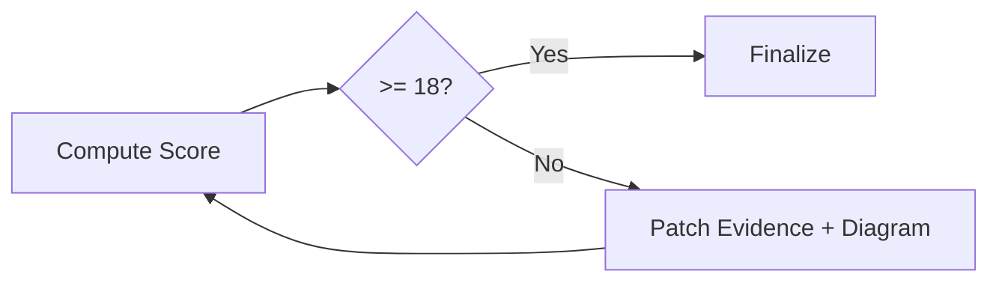

# 09 Quality Scorecard

## Score Grid

| Dimension | Score (0-5) | Evidence |
|---|---|---|
| Global clarity | | |
| Executable path clarity | | |
| Risk actionability | | |
| Evidence completeness | | |
| Onboarding friendliness | | |
| Chart/Table ratio quality | | |

## Thresholds

| Rule | Result |
|---|---|
| Total score | |
| Pass condition | `>= 18` |
| If fail | Mandatory one iteration |
| Chart/Table target | `>= 70%` |

## Iteration Delta

| Gap | Fix Action | Updated Artifact |
|---|---|---|
| | | |

## Final Check

