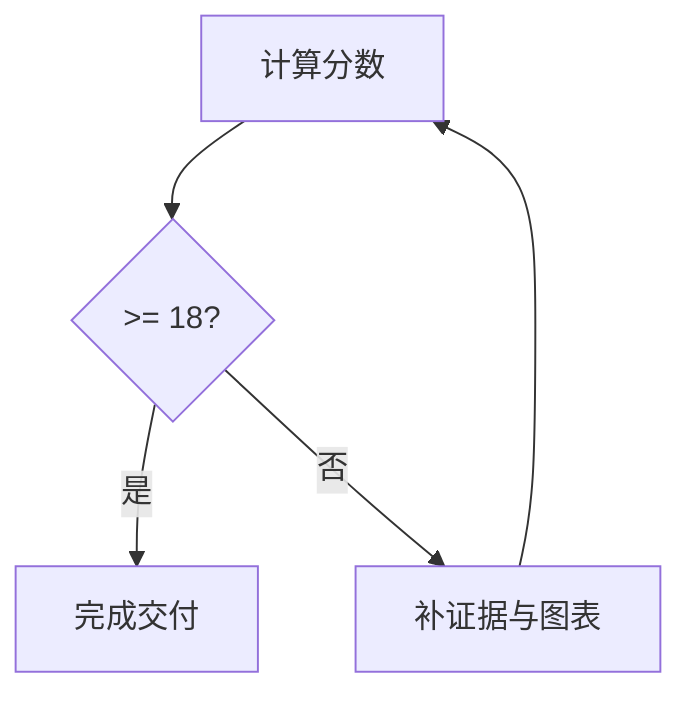

# 09 质量评分卡

## 评分表

| 维度 | 分数（0-5） | 证据 |
|---|---|---|
| 全局清晰度 | | |
| 链路可执行性 | | |
| 风险可操作性 | | |
| 证据完整性 | | |
| 上手友好度 | | |
| 图表/表格占比质量 | | |
| Obsidian 图表可读性 | | |

## 阈值

| 规则 | 结果 |
|---|---|
| 总分 | |
| 通过条件 | `>= 18` |
| 未通过时 | 必须迭代一次 |
| 图表/表格目标 | `>= 70%` |
| 图表可读性闸门 | 不应出现需要横向滚动或交叉线密集的图 |

## 迭代差异

| 缺口 | 修复动作 | 更新产物 |
|---|---|---|
| | | |

## 图表复核

| 图 | 节点数 | 边数 | 宽度通过（`Y/N`） | 交叉/密度通过（`Y/N`） | 动作 |
|---|---:|---:|---|---|---|
| 上下文 | | | | | |
| 模块 | | | | | |
| 时序 | | | | | |
| 风险 | | | | | |

## 最终检查

