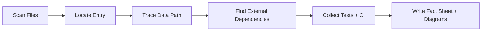

# 10 Command Cookbook

## Scan and Mapping Commands

| Goal | Command |
|---|---|
| List all files | `rg --files` |
| Top-level structure | `Get-ChildItem -Force` |
| Find entry/router symbols | `rg -n "main\(|router|Controller|Service|Repository" -S .` |
| Find runtime/deploy files | `rg -n "Dockerfile|workflow|pipeline|k8s|helm" -S .` |
| Find schema/migration | `rg -n "migration|schema|alembic|gorm|sequelize|Entity|Model" -S .` |
| Find SQL usage | `rg -n "SELECT |INSERT |UPDATE |DELETE " -S .` |
| Find outbound calls | `rg -n "http://|https://|axios|requests\.|FeignClient|grpc|kafka|rabbit|sqs" -S .` |
| Find config/env usage | `rg -n "\.env|config|settings|application\.yml|application\.yaml" -S .` |
| Find test entry points | `rg -n "pytest|jest|go test|@Test|unittest" -S .` |
| Find CI checks | `rg -n "lint|build|test|deploy" -S .github` |

## Evidence Capture Pattern

| Capture Item | Format |
|---|---|
| File evidence | `path:line + symbol` |
| Confidence | `HIGH / MEDIUM / LOW` |
| Impact | `Decision affected if wrong` |

## Command Flow

