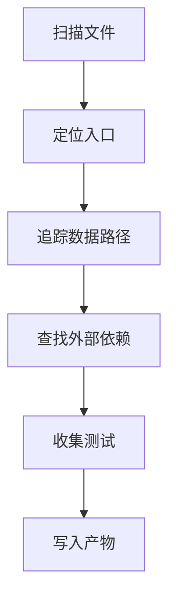

# 10 侦察命令速查

## 扫描与建图命令

| 目标 | 命令 |
|---|---|
| 列出全部文件 | `rg --files` |
| 查看顶层结构 | `Get-ChildItem -Force` |
| 查找入口/路由符号 | `rg -n "main\(|router|Controller|Service|Repository" -S .` |
| 查找运行/部署文件 | `rg -n "Dockerfile|workflow|pipeline|k8s|helm" -S .` |
| 查找 schema/migration | `rg -n "migration|schema|alembic|gorm|sequelize|Entity|Model" -S .` |
| 查找 SQL 使用 | `rg -n "SELECT |INSERT |UPDATE |DELETE " -S .` |
| 查找出站调用 | `rg -n "http://|https://|axios|requests\.|FeignClient|grpc|kafka|rabbit|sqs" -S .` |
| 查找配置/env 使用 | `rg -n "\.env|config|settings|application\.yml|application\.yaml" -S .` |
| 查找测试入口 | `rg -n "pytest|jest|go test|@Test|unittest" -S .` |
| 查找 CI 检查 | `rg -n "lint|build|test|deploy" -S .github` |

## 证据记录格式

| 记录项 | 格式 |
|---|---|
| 文件证据 | `path:line + symbol` |
| 置信度 | `HIGH / MEDIUM / LOW` |
| 影响 | `如果判断错误会影响的决策` |

## 命令流程

