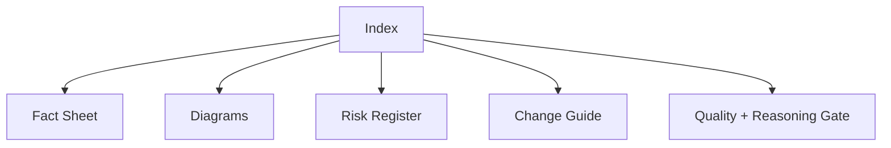

# 11 Output Index Template

## Header

| Field | Value |
|---|---|
| Repository | |
| Analysis date | |
| Mode | |
| Analyst | |

## Artifact Index

| # | Artifact | Status (`Done/WIP/NA`) |
|---|---|---|
| 1 | `00-intake.md` | |
| 2 | `01-fact-sheet.md` | |
| 3 | `02-system-diagrams.md` | |
| 4 | `03-module-catalog.md` | |
| 5 | `04-dependency-risk-register.md` | |
| 6 | `05-change-entry-guide.md` | |
| 7 | `06-ops-release-observability.md` | |
| 8 | `07-roadmap-techdebt.md` | |
| 9 | `08-timebox-playbook.md` | |
| 10 | `09-quality-scorecard.md` | |
| 11 | `10-command-cookbook.md` | |
| 12 | `12-reasoning-iteration.md` | |

## Executive Snapshot

| Item | Content |
|---|---|
| System in one sentence | |
| Current top risk | |
| Safest first change | |
| Next verification action | |

## Delivery Map

