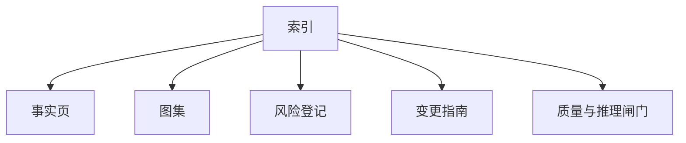

# 11 输出索引模板

## 头信息

| 字段 | 值 |
|---|---|
| 仓库 | |
| 分析日期 | |
| 模式 | |
| 分析者 | |

## 产物索引

| # | 产物 | 状态（`Done/WIP/NA`） |
|---|---|---|
| 1 | `00-intake.md` | |
| 2 | `01-fact-sheet.md` | |
| 3 | `02-system-diagrams.md` | |
| 4 | `03-module-catalog.md` | |
| 5 | `04-dependency-risk-register.md` | |
| 6 | `05-change-entry-guide.md` | |
| 7 | `06-ops-release-observability.md` | |
| 8 | `07-roadmap-techdebt.md` | |
| 9 | `08-timebox-playbook.md` | |
| 10 | `09-quality-scorecard.md` | |
| 11 | `10-command-cookbook.md` | |
| 12 | `12-reasoning-iteration.md` | |

## 执行摘要

| 项目 | 内容 |
|---|---|
| 一句话系统说明 | |
| 当前首要风险 | |
| 最安全的首个改动 | |
| 下一步验证动作 | |

## 交付地图

