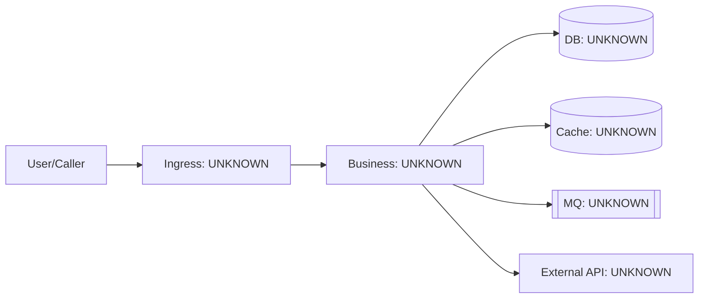
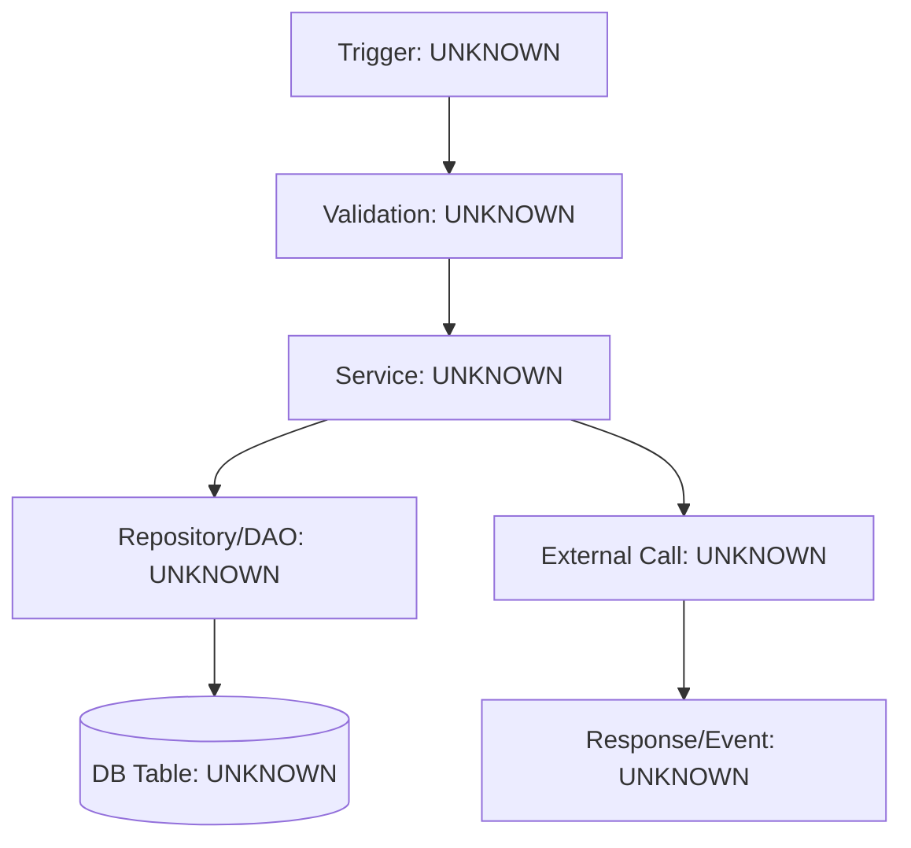
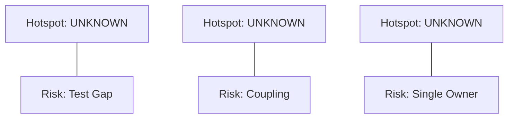

# Global Map Output Template

## 1) 关键事实清单

- 业务目标：
- 启动方式：
- 入口模块：
- 核心业务模块：
- 数据落点（DB/Cache/MQ）：
- 外部系统依赖：
- 测试与发布路径：

## 2) 系统总览图

## 3) 核心链路图（选 1 条真实链路）

## 4) 风险热点图

## 5) 下一步 3 个动作

1. 验证主链路：
2. 降低风险：
3. 提升认知：
