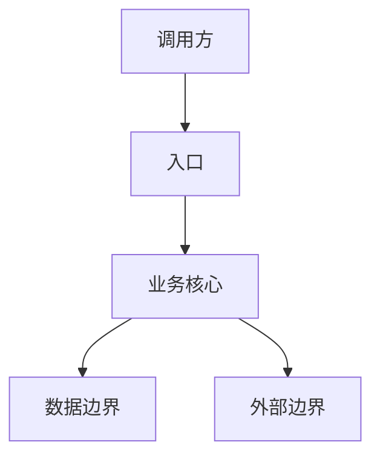
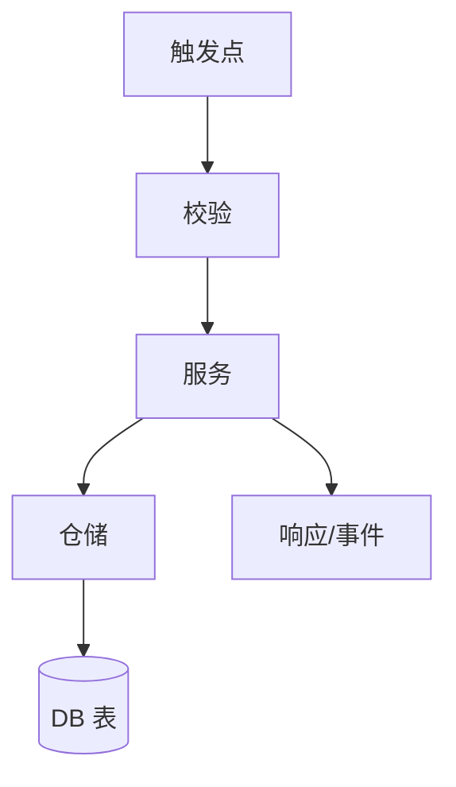

# 全局地图输出模板

## 1. 关键事实清单

- 业务目标：
- 启动方式：
- 入口模块：
- 核心业务模块：
- 数据落点（DB/Cache/MQ）：
- 外部系统依赖：
- 测试与发布路径：

## 2. 系统总览图

Obsidian 可读性预算：优先纵向图，5-9 节点最佳，最多 12 节点；依赖超过 5 个时拆成“总览图 + 依赖表”。

| 节点 | 真实文件/符号 | 证据 | 置信度 |
|---|---|---|---|
| 调用方 | UNKNOWN | UNKNOWN | LOW |
| 入口 | UNKNOWN | UNKNOWN | LOW |
| 业务核心 | UNKNOWN | UNKNOWN | LOW |
| 数据边界 | UNKNOWN | UNKNOWN | LOW |
| 外部边界 | UNKNOWN | UNKNOWN | LOW |

## 3. 数据与外部依赖表

优先用表格承载依赖细节，避免总览图变成蜘蛛图。

| 类型 | 名称 | 配置/调用点 | 风险 | 证据 |
|---|---|---|---|---|
| DB | UNKNOWN | UNKNOWN | UNKNOWN | UNKNOWN |
| Cache | UNKNOWN | UNKNOWN | UNKNOWN | UNKNOWN |
| MQ | UNKNOWN | UNKNOWN | UNKNOWN | UNKNOWN |
| External API | UNKNOWN | UNKNOWN | UNKNOWN | UNKNOWN |

## 4. 核心链路图（选 1 条真实链路）

| 步骤 | 真实文件/符号 | 证据 | 置信度 |
|---|---|---|---|
| 触发点 | UNKNOWN | UNKNOWN | LOW |
| 校验 | UNKNOWN | UNKNOWN | LOW |
| 服务 | UNKNOWN | UNKNOWN | LOW |
| 仓储 | UNKNOWN | UNKNOWN | LOW |
| DB 表 | UNKNOWN | UNKNOWN | LOW |
| 响应/事件 | UNKNOWN | UNKNOWN | LOW |

## 5. 风险热点矩阵

默认用矩阵，不用大图。只有当“关系结构本身”是重点时才画 3-5 节点小图。

| 热点 | 风险 | 触发条件 | 监控/验证信号 | 下一步动作 |
|---|---|---|---|---|
| UNKNOWN | 测试缺口 | UNKNOWN | UNKNOWN | UNKNOWN |
| UNKNOWN | 耦合 | UNKNOWN | UNKNOWN | UNKNOWN |
| UNKNOWN | 单一负责人 | UNKNOWN | UNKNOWN | UNKNOWN |

## 6. 下一步 3 个动作

1. 验证主链路：
2. 降低风险：
3. 提升认知：

