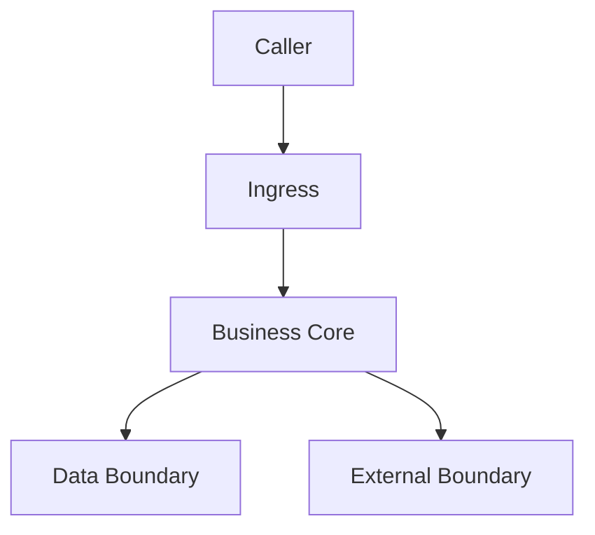
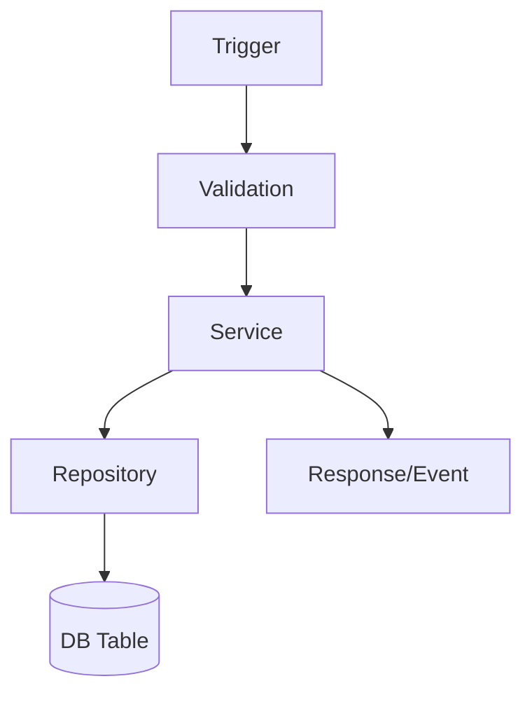

# Global Map Output Template

## 1) 关键事实清单

- 业务目标：
- 启动方式：
- 入口模块：
- 核心业务模块：
- 数据落点（DB/Cache/MQ）：
- 外部系统依赖：
- 测试与发布路径：

## 2) 系统总览图

Obsidian 可读性预算：优先纵向图，5-9 节点最佳，最多 12 节点；依赖超过 5 个时拆成“总览图 + 依赖表”。

| 节点 | 真实文件/符号 | 证据 | 置信度 |
|---|---|---|---|
| Caller | UNKNOWN | UNKNOWN | LOW |
| Ingress | UNKNOWN | UNKNOWN | LOW |
| Business Core | UNKNOWN | UNKNOWN | LOW |
| Data Boundary | UNKNOWN | UNKNOWN | LOW |
| External Boundary | UNKNOWN | UNKNOWN | LOW |

## 3) 数据与外部依赖表

优先用表格承载依赖细节，避免总览图变成蜘蛛图。

| 类型 | 名称 | 配置/调用点 | 风险 | 证据 |
|---|---|---|---|---|
| DB | UNKNOWN | UNKNOWN | UNKNOWN | UNKNOWN |
| Cache | UNKNOWN | UNKNOWN | UNKNOWN | UNKNOWN |
| MQ | UNKNOWN | UNKNOWN | UNKNOWN | UNKNOWN |
| External API | UNKNOWN | UNKNOWN | UNKNOWN | UNKNOWN |

## 4) 核心链路图（选 1 条真实链路）

| 步骤 | 真实文件/符号 | 证据 | 置信度 |
|---|---|---|---|
| Trigger | UNKNOWN | UNKNOWN | LOW |
| Validation | UNKNOWN | UNKNOWN | LOW |
| Service | UNKNOWN | UNKNOWN | LOW |
| Repository | UNKNOWN | UNKNOWN | LOW |
| DB Table | UNKNOWN | UNKNOWN | LOW |
| Response/Event | UNKNOWN | UNKNOWN | LOW |

## 5) 风险热点矩阵

默认用矩阵，不用大图。只有当“关系结构本身”是重点时才画 3-5 节点小图。

| 热点 | 风险 | 触发条件 | 监控/验证信号 | 下一步动作 |
|---|---|---|---|---|
| UNKNOWN | Test gap | UNKNOWN | UNKNOWN | UNKNOWN |
| UNKNOWN | Coupling | UNKNOWN | UNKNOWN | UNKNOWN |
| UNKNOWN | Single owner | UNKNOWN | UNKNOWN | UNKNOWN |

## 6) 下一步 3 个动作

1. 验证主链路：
2. 降低风险：
3. 提升认知：
